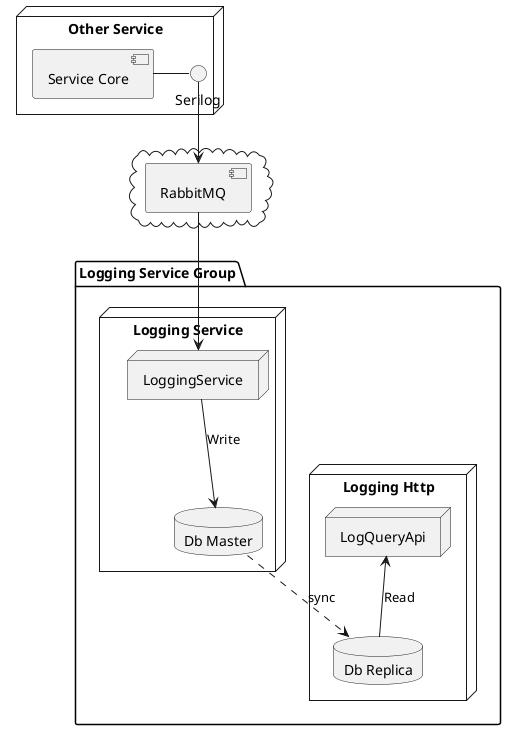

# Build an Independent Audit Logging Service with CQRS Pattern

Logs are playing an important role for any modern commercial applications. With logs,
- Marketing Dept is able to analyze clients' behaviours and predict the market
- Customer Service Dept is able to search relevant history information for complaints
- Technical staffs are able to figure out where the defects come from with technical details

Furtunately, logging libraries already exist for most of the popular programming languages. Azure, AWS, GCP are all providing excellent cloud-based logging services. Developers can easily output their logs with these existing libraries or services.

However, things might be complex in practice. 
- Some teams have to pay too much for cloud logging services just because of improper configurations. 
- Some teams are still trying to log on every server instance to find out how a payment transaction failed. 
- Some teams have to pay for huge database backups for their rapidly increasing database while 95% of them are logs.
- Some teams run complex queries from log databases which takes seconds every time and then impact their core business services.

Just as everyone knows, the most important thing is to know the actual requirements before the decison is made. Nobody wants to pay a lot for useless services, or reinvent wheels with lots of efforts.

I'm not going to talk about any actual requirements and the relevant solutions. Actually, I just want to focus techniques. In other words, this is just trying some new architecture patterns which probably could be used in other systems in future:
-	CQRS pattern
-	Event Sourcing pattern

### Architecture

### Key Features

* CQRS (*Command Query Responsibility Segregation*) Pattern
* Publish-Subscribe Pattern for commands
* WebAPI for queries
* No authentication at the stage

### Infrastructures
* Database: Postgres with replication(s)
* Message Queue: RabbitMQ

### Components
* Abstractions: models & interfaces
* Repository & Migrations
* MQ Service for commands
* Http API for queries
* Unit Tests
* Integration Test Service

## Audit Message

* Time: 
* Level: INFO, DEBUG, ERROR
* Event: 
* Message: Human readable string
* Http Context: host, http method, path, remote address, user id …
* Platform Context: host, pod, container, namespace …
* Runtime Context: class, file, method, module …
* Business Context: 
* Custom Data: JSON formatted string

### Scope
- Storage
-	Collection

### Not In Scope
-	Analysis

